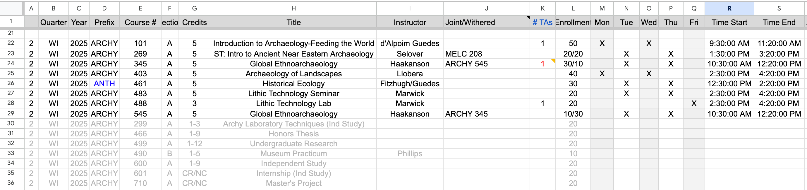
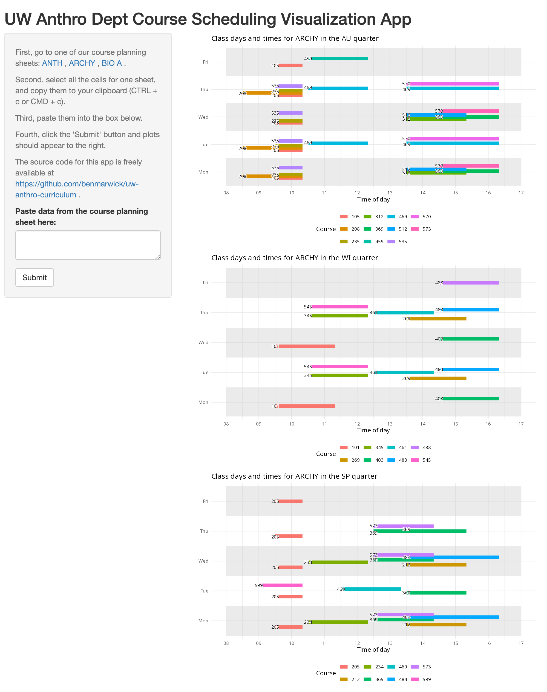

# UW Anthro course viz

The goal of this application is to visualise the days and times of class meets to assist in scheduling classes to minimize overlaps and optimise program needs. The application can be accessed here: <https://benmarwick.github.io/uw-anthro-course-viz/>

To use the app, **first** open one of our course planning spreadsheets: [ANTH](https://docs.google.com/spreadsheets/d/1LEg20-MM1noo5Kq6W4MYFe4IUObB5ZveDj8uGZ75fPE/edit?gid=925449122#gid=925449122), [ARCHY](https://docs.google.com/spreadsheets/d/1qu6Dl1ua2dLnkeR-j3ek1OJWAEVATlIdSJzjpH8CoAQ/edit?gid=1500143646#gid=1500143646), [BIO A](https://docs.google.com/spreadsheets/d/15UlwHFfsHngtT5VXnyLs6EinHqBtWuyOphy5ZaHLmXo/edit?gid=509696154#gid=509696154), which should look like the screenshot below. These sheets are not public, they are only accessible to UW Anthro faculty and staff. It is important that the column names are **identical** to those in the screenshot, especially Quarter, Prefix, Course #, Title, Mon-Fri, Time Start and Time End.

**Second**, select all the cells for one sheet (e.g. the sheet for the current year), and copy them to your clipboard (e.g. press CTRL + c or CMD + c to copy). It does not matter if you have selected empty cells.

**Third**, paste the cells you've copied into the box on the left side of the app.

**Fourth**, click the 'Submit' button on the app, and plots should appear to the right, as shown in the screenshot below. The app will not show courses that have cell values in non-standard formats, i.e. anything that differs from what's the screenshot above.

